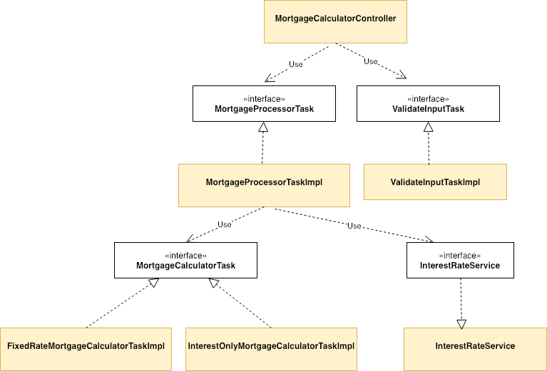
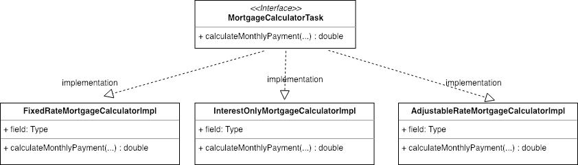
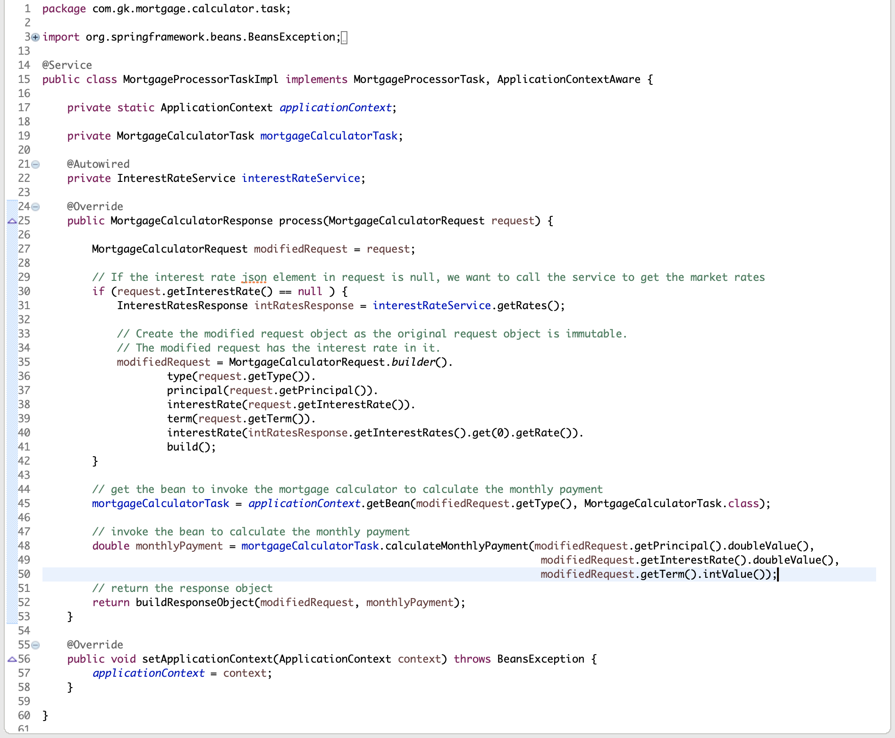

== Introduction

SOLID is an acronym for five design principle that make code easier to understand, easier to test, easier to maintain and more flexible.
Robert C. Martin, one of the key authors of the Agile Manifesto is a big proponent of the SOLID design principles.
The SOLID principles were first conceptualized by Robert C. Martin in his 2000 paper,

TDD is an acronym that stands for Test Driven Development which means that tests are written first followed by the code to make the test pass.
TDD is one of the main tenets of XP (Extreme Programming), which has gained a lot of traction in the industry.

Many developers that I speak to who are on projects where TDD is practiced, complain that refactoring code becomes difficult because there are too many tests and most of the time is spent fixing the tests.
The ideal state to achieve is the perfect amount of tests the capture the complete behavior of the application while also making the application easy to maintain and easy to refactor.

I have found that while developing software using a TDD approach, designing the application using the SOLID design principles resulted in fewer tests that enabled faster refactoring and a better designed application.
In this paper we will discuss the five SOLID design principles in the context of a sample mortgage calculator application and demonstrate how it enables simpler and fewer tests
that properly capture the behavior of an application.

== SOLID Principles Explained

The five principles are

. Simple Principle
. Open / Closed Principle
. Liskov Substitution Principle
. Interface Segregation Principle
. Dependency Injection Principle

We will discuss the SOLID principles and how they were used in the context of the sample mortgage calculator application that was developed.
The mortgage calculator is an api application that calculates monthly mortgage payments for various types of mortgages such as
fixed rate (30 year, 15 year etc) or interest only mortgages.

=== Simple Principle

This principle states

* A class should have only a single responsibility.

If you look at the structure of the code in figure 1, each class (yellow rectangles) only has a single responsibility.
This makes each class very easy to test.  From a TDD perspective, it makes it very easy to describe the behavior of each class using tests.

.Description of classes and tests for each class
[options="header,footer"]
|=======================
|Class name|Description of class     |Description of Tests
|MortgageCalculatorController    |Defines the API by specifying the request and response.     |Captures the API behavior for success cases as well as all exceptions. Should not test for correction of mortgage calculations. Tests should capture the http behavior as well as the java behavior.
|ValidatorInputTaskImpl    |Validates the input to ensure request has proper data.     |Caputres all the various invalid requests and ensure proper exception is thrown.
|MortgageProcessorTaskImpl    |Processes the request and delegates to the appropriate calculator.    |Tests only capture that the necessary response values exist and not correctness of the response.
|FixedRateMortgageCalculatorTaskImpl    |Calculates the monthly mortgage payment for fixed rate mortgages.|Tests capture and ensure the correct monthly payment is calculated.
|InterestOnlyMortgageCalculatorTaskImpl    |Calculates the monthly mortgage payment for interest only mortgages.|Tests capture and ensure the correct monthly payment is calculated.
|=======================

=== Open / Closed Principle

This principle states

* Software entities should be open for extension, but closed for modification.

* Be able to add new functionality without changing existing code.

image::images/open-closed-principle.png[]

In the diagram above, you can see that in the code there is an interface called MortgageCalculatorTask.
This interface has a single method called calculateMonthlyPayment(...) which represents the contract that is closed for modification.
This interface has two implementations - FixedRateMortgageCalculatorImpl and InterestOnlyMortgageCalculatorImpl.
The design is open for extension so if we want to extend the functionality of the app to support adjustable rate mortgages,
all we have to do is create a third implementation class called AdjustableRateMortgageCalculatorTask.  See the figure below.

Now what about the important point that we should be able to add new functionality without changing existing code.
This is supported by the Spring framework where we dynamically inject the appropriate implementation class during runtime.
If you look at the structure of the code, the MortgageProcessorTask is responsible for determining how to process the request
and instantiating the correct implementation class.  Lets take a closer look at how this class is implemented.

Line 34 of this class, uses the Spring application context 'getBean(...)' method to get an instance of a spring managed bean of type MortgageCalculatorTask during runtime.
The 'getBean(...)' method will either return an instance of 'FixedRateMortgageCalculatorImpl' or 'InterestOnlyMortgageCalculatorImpl'.
Therefore, if we add the new feature to calculate monthly payments for AdjustableRateMortgages, we do not have to change a single line of code in MortgageProcessorTaskImpl.
This meets the requirement of 'add functionality without changing existing code'.
From a TDD perspective, we only need to create unit tests to test and capture the behavior of the new feature, i.e. the AdjustableRateMortgageCalculatorImpl class.

=== Liskov Substitution Principle

The Liskov substitution principle states

* Objects in a program should be replaceable with instances of their subtypes without altering the correctness of that program.

This principle is closely related to the Open/Closed principal.
This principle defines that objects of a superclass shall be replaceable with objects of its subclasses without breaking the application.
That requires the objects of your subclasses to behave in the same way as the objects of your superclass.
You can achieve this by following a few rules, which are pretty similar to the design by contract concept defined by Bertrand Meyer.

In our example ‘FixedRateMortgageCalculatorTaskImpl’ and ‘InterestOnlyMortgageCalculatorTaskImpl’ implement the MortgageCalculatorTask interface so they are a type or sub-class of MortgageCalculatorTask.

The code in MortgageProcessorTaskImpl.process(…) invokes the calculate method on whatever bean implementation gets injected into it (i.e. FixedRate or InterestOnly) at runtime.
We can easily add new types of mortgage calculators and the MortgageProcessorTaskImpl class would not have to change at all.  The application does not break by doing this.

The implication from a unit test perspective is that unit tests need to be written for only the new feature (i.e a new mortgage calculator type) as there is no risk of breaking other parts of the application.

=== Interface Segregation Principle

text

=== Dependency Injection Principle

The dependency injection principle states

* High-level modules should not depend on low-level modules. Both should depend on abstractions.

* Abstractions should not depend on details. Details should depend on abstractions.

To explain the first statement, lets look at the figure xxx in the 'Simple Principle' section we can see that the MortgageCalculatorController class which is the higher level module,
and its lower level module, which is the MortgageProcessorTaskImpl do not depend on each other.  They both depend on the abstraction which is the MortgageProcessorTask.
MortgageCalculatorController is only aware of the interface and is not aware of any concrete implementation classes.
Similarly, MortgageProcessorTaskImpl depends on the MortgageProcessorTask interface via the implementation relationship. It is not aware of who uses it.
The significance of this is that it makes testing easier.  For example, to test the higher level module MortgageCalculatorController, I want to mock all its dependencies.
From a test perspective, I can simply inject the mock dependent objects in order to ensure that the class under test is behaving as expected.

== Conclusion

text

== Bibliography
1. Design Principles and Design Patterns, Robert C. Martin, https://fi.ort.edu.uy/innovaportal/file/2032/1/design_principles.pdf
2. The Agile Manifesto, https://agilemanifesto.org/principles.html
