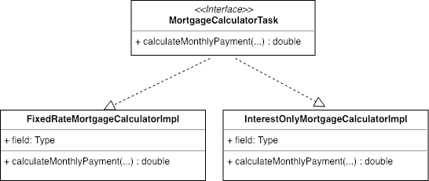

== Introduction

SOLID is an acronym for five design principle that make code easier to understand, easier to test, easier to maintain and more flexible.
These are all critical aspects of good software design especially when doing Test Driven Development (TDD).
Besides helping write good code, understanding SOLID principles will help you when doing code reviews as it provides a good framework for making
suggestions to improve the code. In this post, we will discuss the five principles and we will show real code examples to demonstrate its value.

== SOLID Principles Explained

The five principles are

. Simple Principle
. Open / Closed Principle
. Liskov Substitution Principle
. Interface Segregation Principle
. Dependency Injection Principle

We will discuss the SOLID principles and how they were used in the context of the sample mortgage calculator application that was developed.
The mortgage calculator is an api application that calculates monthly mortgage payments for various type of mortgages such as
fixed rate (30 year, 15 year etc) or interest only mortgages.

=== S - Simple Principle

This principle states

* A class should have only a single responsibility.

If you look at the structure of the code in figure 1, each class only has a single responsibility.
This makes each class very easy to test.  From a TDD perspective, it makes it very easy to describe the behavior of each class using tests.

TODO -  Place figure 1 here (A class diagram representing the architecture of the application)

=== Open / Closed Principle

This principle states

* Software entities should be open for extension, but closed for modification.

* Be able to add new functionality without changing existing code.

=== Liskov Substitution Principle

text

=== Interface Segregation Principle

text

=== Dependency Injection Principle

== Conclusion

text
