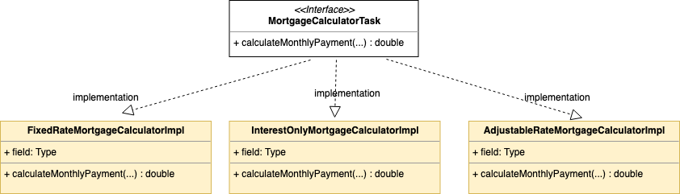

= SOLID Design Principles Makes Test Driven Development Faster and Easier

== Introduction
Delivering cloud native apps to users with speed and quality requires a fully automated solution including a comprehensive test suite providing confidence that the application behaves as expected under all known conditions.
TDD (Test Driven Development) has become a popular method to design and develop software to ensure that the code base is sufficiently tested and its behavior is captured in tests.

A common complaint I keep hearing from developers who are on projects where TDD is practiced is that maintaining code (adding new features, fixing bugs, refactoring) becomes difficult because there are too many tests and most of their time is consumed fixing tests.
Sometimes this can happen because tests attempt to capture more behavior then they should or perhaps, the application design needs to be optimized to better demarcate boundaries of responsibility that can easily be tested.
The ideal state to achieve is one where your tests capture the complete behavior of the application without sacrificing the maintainability of the code to enable development teams to go fast.

I have found that while developing software using a TDD approach, designing the application using the SOLID design principles results in fewer overall tests that better capture the behavior of the application.
In this paper we will discuss the five SOLID design principles in the context of a mortgage calculator application and demonstrate how it promotes a well designed application and enables simpler and fewer tests that are easier to maintain
without sacrificing on capturing the expected behavior of the entire application.

TDD is an acronym that stands for Test Driven Development which means that tests are written first followed by the code to make the test pass.
TDD is one of the main tenets of XP (Extreme Programming), which has gained a lot of traction in the industry.

SOLID is an acronym for five design principles that make code easier to understand, easier to test, easier to maintain and more flexible.
Robert C. Martin, one of the key authors of the Agile Manifesto is a big proponent of both TDD and SOLID design principles.
The SOLID principles were first conceptualized by Robert C. Martin in his 2000 paper.

== SOLID Principles Explained

The five principles are

. Simple Principle
. Open / Closed Principle
. Liskov Substitution Principle
. Interface Segregation Principle
. Dependency Injection Principle

We will discuss the SOLID principles and how they were used in the context of designing and building a mortgage calculator application.
The mortgage calculator is an API application that calculates monthly mortgage payments for various types of mortgages such as
fixed rate (30 year, 15 year etc) or interest only mortgages.

=== Simple Principle

This principle states

* A class should have only a single responsibility.

If you look at the structure of the code in figure 1, each class (yellow rectangles) only has a single responsibility.
This makes each class very easy to test.  From a TDD perspective, it makes it very easy to describe the behavior of each class using tests.

.Code structure of the Mortgage Calculator application demonstrating the Simple principle

The goal is to create tests that capture the unique behavior each class implements and no more. You want to minimize testing redundant behavior
across different parts or layers of the application.  For example, the controller tests should not be responsible for testing that the monthly mortgage
calculations are correct.  Those behaviors are tested and captured by the tests for the two mortgage calculator tasks.
Table 1 below describes the responsibility of each class as well as a description of the tests for each class.

.Description of classes and tests for each class
[options="header,footer"]
|=======================
|Class name|Description of class     |Description of Tests
|MortgageCalculatorController    |Defines the API by specifying the request and response.     |Captures the API behavior for success cases as well as all exceptions. Should not test for correction of mortgage calculations. Tests should capture the http behavior as well as the java behavior.
|ValidatorInputTaskImpl    |Validates the input to ensure request has proper data.     |Caputres all the various invalid requests and ensure proper exception is thrown.
|MortgageProcessorTaskImpl    |Processes the request and delegates to the appropriate calculator.    |Tests only capture that the necessary response values exist and not correctness of the response.
|FixedRateMortgageCalculatorTaskImpl    |Calculates the monthly mortgage payment for fixed rate mortgages.|Tests capture and ensure the correct monthly payment is calculated.
|InterestOnlyMortgageCalculatorTaskImpl    |Calculates the monthly mortgage payment for interest only mortgages.|Tests capture and ensure the correct monthly payment is calculated.
|=======================

=== Open / Closed Principle

This principle states

* Software entities should be open for extension, but closed for modification.

* Be able to add new functionality without changing existing code.

.Code structure of MortgageCalculatorTask and its sub-types demonstrating the open/closed principle
image::images/open-closed-principle.png[]

The figure above describes the MortgageCalculatorTask interface with a single method called calculateMonthlyPayment(...).
This interface represents the contract that is closed closed for modification.
This interface has two implementations - FixedRateMortgageCalculatorImpl and InterestOnlyMortgageCalculatorImpl.
The design is also open for extension. To extend the functionality of the app to support adjustable rate mortgages,
we can create a third implementation class called AdjustableRateMortgageCalculatorTask.  See the figure below.

.Extending the app by adding a new sub-type

Line 34 of the class in figure 4 below, uses the Spring application context 'getBean(...)' method to get an instance of a spring managed bean of type MortgageCalculatorTask during runtime execution.
The 'getBean(...)' method will either return an instance of 'FixedRateMortgageCalculatorImpl' or 'InterestOnlyMortgageCalculatorImpl'.
Therefore, if we add the new feature to calculate monthly payments for AdjustableRateMortgages, we do not have to change a single line of code in MortgageProcessorTaskImpl.
This meets the requirement of 'add functionality without changing existing code'.
From a TDD perspective, we only need to create unit tests to test and capture the behavior of the new feature, i.e. the AdjustableRateMortgageCalculatorImpl class.
We do not need to add any new tests to test the MortgageProcessorTaskImpl as the behavior of this class is not changed.

.Code snippet demonstrating adding new functionality without changing existing code (line 34 in code)

=== Liskov Substitution Principle

The Liskov substitution principle states

* Objects in a program should be replaceable with instances of their subtypes without altering the correctness of that program.

This principle is closely related to the Open/Closed principal.
This principle defines that objects of a superclass shall be replaceable with objects of its subclasses without breaking the application.
That requires the objects of your subclasses to behave in the same way as the objects of your superclass.

In our example ‘FixedRateMortgageCalculatorTaskImpl’ and ‘InterestOnlyMortgageCalculatorTaskImpl’ implement the MortgageCalculatorTask interface so they are a type or sub-class of MortgageCalculatorTask.

The code in MortgageProcessorTaskImpl.process(…) invokes the calculate method on whatever bean implementation gets injected into it (i.e. FixedRate or InterestOnly) at runtime.
We can easily add new types of mortgage calculators and the MortgageProcessorTaskImpl class would not have to change at all.  The application does not break by doing this.

The implication from a unit test perspective is that unit tests need to be written for only the new feature (i.e a new mortgage calculator type) as there is no risk of breaking other parts of the application.

=== Interface Segregation Principle

The interface segregation principle states

* Many client-specific interfaces are better than one general-purpose interface

In our mortgage application app, the 'MortgageCalculatorTask' interface has a single method called 'calculateMonthlyPayment'.
This interface is implemented by two classes.  If we were to add additional capability to the app, for example, showing amortization schedule,
the principle states to segregate the interface by defining a new interface instead of adding a new method to the existing 'MortgageCalculatorTask' interface.

=== Dependency Injection Principle

The dependency injection principle states

* High-level modules should not depend on low-level modules. Both should depend on abstractions.

* Abstractions should not depend on details. Details should depend on abstractions.

To explain the first statement, lets look at figure 1 in the 'Simple Principle' section; we can see that the MortgageCalculatorController class which is the higher level module,
and its lower level module, which is the MortgageProcessorTaskImpl do not depend on each other.  They both depend on the abstraction which is the MortgageProcessorTask interface.
MortgageCalculatorController is only aware of the interface and is not aware of any concrete implementation classes.
Similarly, MortgageProcessorTaskImpl depends on the MortgageProcessorTask interface via the implementation relationship. It is not aware of who uses it.
Furthermore, you can see from the design of the MortgageCalculatorController class, the dependencies are injected by the constructor.  See figure below.
The Spring @Autowired annotation is added to the constructor which does the actual injection of the dependent java objects which are Spring beans.
This concept is known as inversion of control where the framework (i.e. Spring) instantiates and manages the classes as opposed to the developer having to do so explicitly.

.Figure 5:Dependencies are injected in the constructor using Spring @Autowired annotation (line 21 in the code)

The significance of this is that it makes testing easier.  For example, to test the higher level module, MortgageCalculatorController, I want to mock all its dependencies.
From a test perspective, I can simply inject the mock dependent objects in order to ensure that the class under test is behaving as expected.
Furthermore, in this case, since we are testing the behavior of the controller, the tests only need to cover expected response type, exceptions thrown, http api behavior, etc. that are not covered by other parts of the code.
There is no need for controller tests to test the behavior of the mortgage calculation formulas or any other part of the system.  This would be redundant and would make any future code maintenance more costly as more time would need to be spent fixing broken tests.

If we had instantiated the dependencies directly in the code (line 20 and 21) as shown in the figure below, then we would not be able to mock the dependencies complicating the testing effort.

.Figure 6: Dependencies are instantiated directly in the code (line 20 and 21 in the code) making testing of the controller more difficult

To explain the second statement, lets further analyze the MortgageCalculatorTask interface and its two implementations,
'FixedRateMortgageCalculatorTaskImpl' and InterestOnlyMortgageCalculatorTaskImpl as shown in figure 2.
The interface is the 'abstraction' and the two implementations are the details.  The principle basically states that i should
be able to change the implementation without affecting the behavior of the application.  So If I change the implementation of the
'FixedRateMortgageCalculatorTaskImpl -> calculateMonthlyPayment(...)' method, it will not affect the behavior of the app as a whole.
From a TDD and test perspective, I only need to ensure that the new implementation is properly tested and the monthly mortgage payment calculations behave correctly.
All other layers in the code from both a test and implementation perspective should not be affected.  Therefore, you should not expect any broken tests
due to refactoring the implementation.

== Conclusion

In this paper we analyzed how adopting the SOLID design principles while doing test driven development (TDD), makes the application easier to maintain, easier to test and enables
development teams to deliver quality code with speed over a long period of time.
One of the key detriments to going fast is having an overly large test suite and a non-optimized application design.
The SOLID principles, helps you to build a well designed application.  From a TDD perspective, you can design your tests in a way where
the complete behavior of the app is captured and tested, while minimizing the number of tests including redundant tests.

== Bibliography
1. Design Principles and Design Patterns, Robert C. Martin, https://fi.ort.edu.uy/innovaportal/file/2032/1/design_principles.pdf
2. The Agile Manifesto, https://agilemanifesto.org/principles.html
